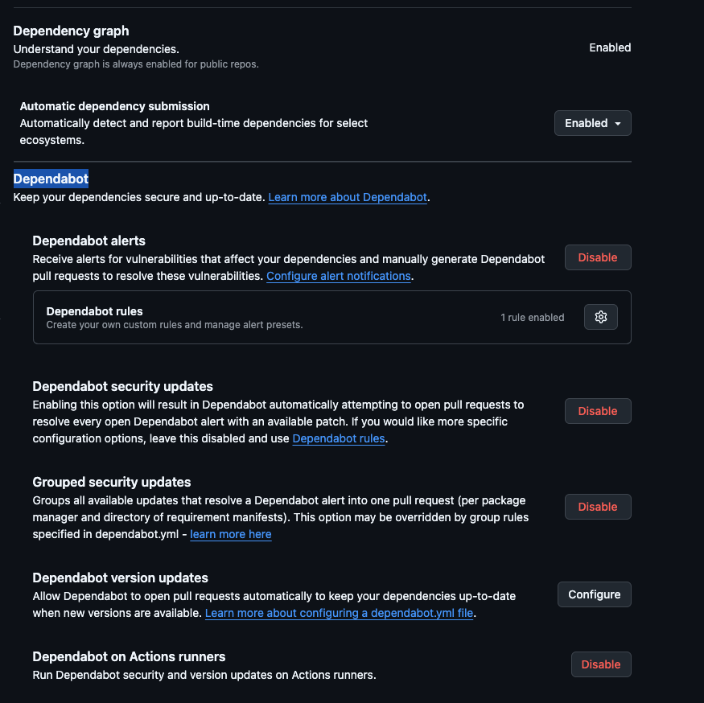
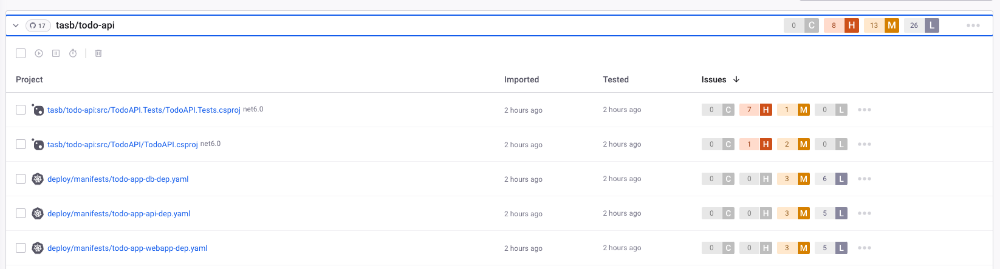
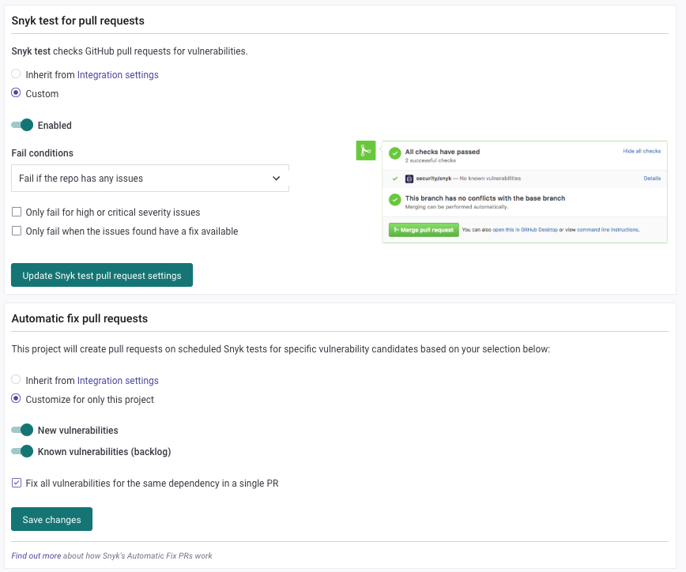
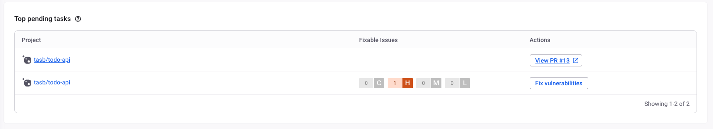

# Lab 03 - Enable SCA

## Table of Contents

- [Goals](#goals)
- [Pre-requisites](#pre-requisites)
- [Guide](#guide)
  - [Step 01: Add Todo App code to the repo](#step-01-add-todo-app-code-to-the-repo)
  - [Step 02: Enable Dependabot](#step-02-enable-dependabot)
  - [Step 03: Configure Dependabot](#step-03-configure-dependabot)
  - [Step 04: Check Dependabot alerts](#step-04-check-dependabot-alerts)
  - [Step 05: Configure Snyk](#step-05-configure-snyk)
  - [Step 06: Configure Snyk integration with GitHub](#step-06-configure-snyk-integration-with-github)
  - [Step 07: Check the PRs created by Snyk](#step-07-check-the-prs-created-by-snyk)
- [Conclusion](#conclusion)

## Goals

- Enable Dependabot on your repository
- Configure Dependabot to check for NuGet packages
- Enable Snyk on your repository
- Configure Snyk to check for vulnerabilities on your project

## Pre-requisites

- Finished [Lab 02](lab02.md) and navigate to the repo used

## Guide

### Step 01: Add Todo App code to the repo

Download the code from this link: [Todo App](https://github.com/tasb/todo-api/archive/refs/tags/v1.zip)

Unzip the file and copy the content to the repo used on the last lab.

Now let's add all files and commit the changes:

```bash
git add -A
git commit -m "Add Todo App code"
```

Now you should get several Talisman alerts. Check the output and add all the files to the `.talismanrc` file.

Now you can push the changes to the remote repository:

```bash
git commit -m "Add Todo App code"
git push
```

### Step 02: Enable Dependabot

Go to your GitHub repository and click on `Settings`.

On the left side, click on `Code Security`.

You should enable all the options on the blocks `Dependency graph` and `Dependabot`. At the end you should get something like this:



### Step 03: Configure Dependabot

On the option `Dependabot version updates` you may click on the button `Configure`.

This will open a new page where you get an yml configuration file.

You should replace all content with this one:

```yaml
version: 2
updates:
  - package-ecosystem: "nuget" # See documentation for possible values
    directories:
      - "/src/TodoAPI"
      - "/src/TodoAPI.Tests"
      - "/src/TodoWebapp"
    schedule:
      interval: "weekly"
    open-pull-requests-limit: 50
```

On this configuration file you are telling Dependabot to check for updates on the NuGet packages on the directories `src/TodoAPI`, `src/TodoAPI.Tests` and `src/TodoWebapp` every week.

If you want to enable this on another project that have more package managers, you can add more blocks under the `updates` key.

Now commit your changes and wait for the workflow to run.

### Step 04: Check Dependabot alerts

The outcome of this workflow should be a new PR per package that has an update available and, in case there is any vulnerability found, you should get Dependabot alerts.

To see the pull requests, you can click on the `Pull requests` tab on your repository.

To check the alerts, you can click on the `Security` tab and then on `Dependabot alerts`.

You can navigate to the `Insights` tab and check the `Dependency graph` to see the dependencies of your project.

### Step 05: Configure Snyk

Now we'll configure Snyk on the repository. This tools has a complete suite of SCA, SAST and they just bought `Probely` tool for DAST.

Navigate to the [Snyk website](https://snyk.io/) and create an account. You should use your GitHub account as the login method, this will make the integration easier.

After you do the login you'll get a list of repos you have on your GitHub account. Select the one you're using on this lab.

Snyk automatically scan your repo and show you the vulnerabilities found. You should get an output like this:



Take a deeper look and check that Snyk made the scan not only on dotnet project but even on Kubernetes and Docker related files.

Click on each dotnet related projects and check the vulnerabilities found. Take your time do understand the vulnerabilities and all information provided by Snyk.

You lose track when to find the projects, you can always click on the `Projects` tab and navigate to the project you want to check.

### Step 06: Configure Snyk integration with GitHub

When you navigate to each project, click on `Settings` and then on `GitHub Integration`.

Change the configuration to match the following image:



This will make Snyk create a PR on your repo with the vulnerabilities found and the fixes for them.

### Step 07: Check the PRs created by Snyk

Navigate to `Dashboard` option on left menu and you should get a list of pending tasks like this:



Click on the button `Fix Vulnerabilities` and you should get a summary of the steps on how to fix this vulnerability.

At that screen, you can click on the `Open a Fix PR` button and Snyk will create a PR on your repo with the fixes.

Return to your GitHub repo and check the PRs created by Snyk. Snyk add all the details on the PR description and you can check the changes made by Snyk.

If you return to the Snyk dashboard, you should see a button to navigate directly to the PR created by Snyk.

If you closed the PR with a successfully merge, you should see the task as completed on the Snyk dashboard.

## Conclusion

Congratulations! Now you have two tools that will help you to keep your project secure and scan for vulnerabilities on your libraries and dependencies.

On this lab you have learned how to enable SCA on your project using Dependabot and Snyk. You also learned how to configure Dependabot and Snyk to create PRs on your repo with the fixes for the vulnerabilities found.
