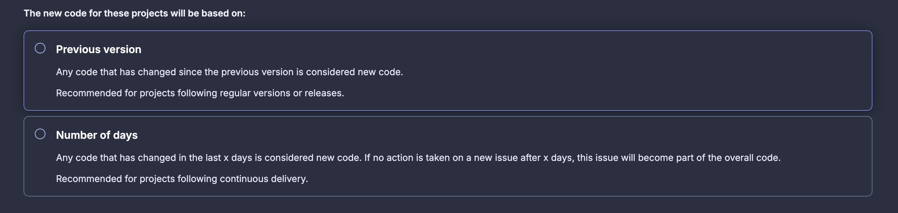

# Lab 04 - Enable SAST

## Table of Contents

- [Goals](#goals)
- [Pre-requisites](#pre-requisites)
- [Guide](#guide)
  - [Step 01: Add CodeQL Scanning](#step-01-add-codeql-scanning)
  - [Step 02: Review the results](#step-02-review-the-results)
  - [Step 03: Create SonarCloud Account](#step-03-create-sonarcloud-account)
  - [Step 04: Configure SonarCloud analysis](#step-04-configure-sonarcloud-analysis)
  - [Step 05: Review SonarCloud results](#step-05-review-sonarcloud-results)
- [Conclusion](#conclusion)

## Goals

- Enable CodeQL scanning on your repository
- Review the results of the CodeQL scanning
- Create a SonarCloud account
- Configure SonarCloud analysis on your repository
- Review the results of the SonarCloud analysis

## Pre-requisites

- Finished [Lab 03](lab03.md) and navigate to the repo used

## Guide

### Step 01: Add CodeQL Scanning

Code QL is a powerful static analysis tool that can be used to scan your code for vulnerabilities. It is a part of the GitHub Advanced Security suite and is available for free for public repositories.

Code QL bases its scanning on a series of queries that are run against your code. These queries are written in a language called QL. You can write your own queries or use the ones provided by GitHub.

To enable Code QL scanning, you need to create a workflow file in the `.github/workflows` directory. This file will contain the steps to run the Code QL scanning.

You can do this manually or using the GitHub Actions workflow generator. On this lab, we will use the generator.

On your repository, click on the `Settings` tab and then on `Code Security` on the left menu.

Find the `Code scanning` section and click on `Set up` on CodeQL analysis block.

You can select the `Default` configuration or `Advanced` configuration. For this lab, we will use the `Advanced` configuration.

You'll be redirected to a page where you can edit the workflow file. You can take some time to review the file and check the links added on the comments.

But for this lab, you need to replace the content of the file with the following:

```yaml
name: "CodeQL Advanced"

on:
  push:
    branches: [ "main" ]
  pull_request:
    branches: [ "main" ]
  schedule:
    - cron: '00 01 * * *'

jobs:
  analyze:
    name: Analyze (${{ matrix.language }})
    runs-on: ${{ (matrix.language == 'swift' && 'macos-latest') || 'ubuntu-latest' }}
    permissions:
      security-events: write
      packages: read
      actions: read
      contents: read

    strategy:
      fail-fast: false
      matrix:
        include:
        - language: csharp
          build-mode: none
        - language: javascript-typescript
          build-mode: none
    steps:
    - name: Checkout repository
      uses: actions/checkout@v4

    # Initializes the CodeQL tools for scanning.
    - name: Initialize CodeQL
      uses: github/codeql-action/init@v3
      with:
        languages: ${{ matrix.language }}
        build-mode: ${{ matrix.build-mode }}
        queries: security-extended,security-and-quality

    - name: Perform CodeQL Analysis
      uses: github/codeql-action/analyze@v3
      with:
        category: "/language:${{matrix.language}}"
```

Let's review some key parts of the workflow file.

First, the triggers for the workflow are defined in the `on` section. 

```yaml
on:
  push:
    branches: [ "main" ]
  pull_request:
    branches: [ "main" ]
  schedule:
    - cron: '00 01 * * *'
```

The workflow will run on every push to the `main` branch, every pull request to the `main` branch, and every day at 1 AM.

Then, when you defined the languages to be scanned. 

```yaml
matrix:
  include:
  - language: csharp
    build-mode: none
  - language: javascript-typescript
    build-mode: none
```

In this case, we are scanning `csharp` and `javascript-typescript` code.

Finally, the queries to be run are defined in the `queries` parameter of the `Initialize CodeQL` step.

```yaml
queries: security-extended,security-and-quality
```

These are the default queries provided by GitHub. You can also write your own queries.

Now you can commit the changes to the repository and the workflow will run automatically.

Click on `Commit changes...` and then on `Actions` to see the workflow running.

This workflow will take some time to run. You can check the progress by clicking on the workflow name.

### Step 02: Review the results

After the workflow finishes, you can check the results by clicking on the `Security` tab on the repository.

Then select `Code Scanning` option and you get a list of the findings that CodeQL produced after analyzing your code.

On the top of the list you get the information that you have one tool scanning your code.

Click on that option and get some insights about CodeQL execution.

Than return to the list and click on any of them to check the details of the finding.

On that page, you can get all information about the finding and a way to directly create an issue to track the fix.

### Step 03: Create SonarCloud Account

Now let's tray another static analysis tool, SonarCloud.

First, you need to create an account on SonarCloud. You can use your GitHub account to sign in.

Navigate to the [SonarCloud website](https://sonarcloud.io/), click on `Try Now` and then on `GitHub`.

Then, to start using SonarCloud Integration, you need to create a new organization. Click on `Import an organization`.

Select the your user account organization and click on `Configure`. Next you may have to follow your GitHub authentication process.

On next page, scroll down and find `Repository access` section. Select if you want to enable on all repositories or select only the one used on this labs.

Pay attention that free SonarCloud Accounts are limited to public repositories.

After SonarCloud finish GitHub App configuration, you'll navigate to the SonarCloud page to finish organization setup.

You already have some recommendations to organization name and key value but you can customize them.

Finally, select the free plan and click on `Create organization`.

### Step 04: Configure SonarCloud analysis

Now that you have your SonarCloud account, you need to configure the analysis on your repository.

After configuring the organization, you'll be redirected to the organization page.

You should see a list of project that you defined on the GitHub side to be available on SonarCloud.

Select the repo used on this labs and click on `Set Up`.

On next screen you have an important configuration on SonarCloud.

You need to define how SonarCloud define what is a new code. You can use the default configuration or customize it.

New Code is the code that was added or changed since the last analysis. This is important to track the evolution of the code quality.



This is even more important when you are enabling SonarCloud on a existing project.

For this lab, you'll use the `Previous version` option. This means SonarCloud define new code every time you push changes to your default branch.

Now you can click on Create Project to start the analysis.

You need to wait for some minutes to get the first analysis done.

### Step 05: Review SonarCloud results

After SonarCloud finish the analysis, you can navigate to the project page and check the results.

On the Summary page, you get a lot of information about the project and some metrics you can explore.

Then you can navigate to the `Issues` tab to check the findings. Please take some time to understand the findings and the information provided by SonarCloud.

On the `Measures` tab you get some metrics about the project. You can check that SonarCloud can give you metrics around code security but about code coverage or maintainability of you code.

Finally, on `Code` tab you can navigate through the source code and check the findings on the code.

On left menu, you can check all branches and open pull requests to check the analysis on each one.

## Conclusion

Congratulations! You have enabled two powerful static analysis tools on your repository.
