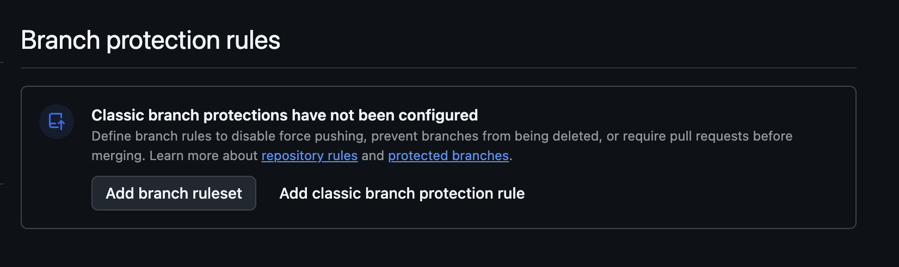
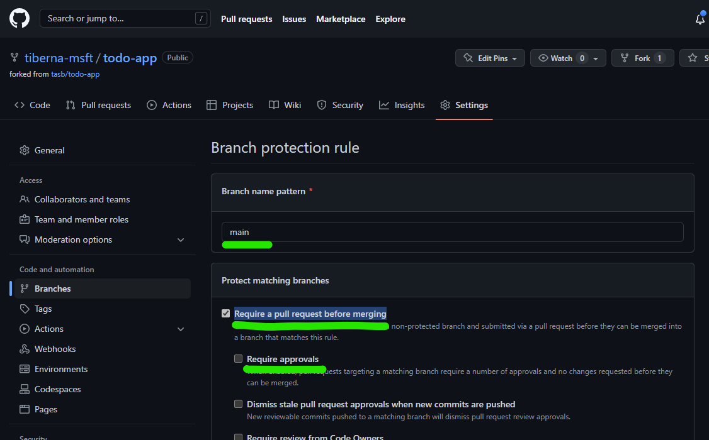

# Lab 05 - Create your initial workflow

## Table of Contents

- [Goals](#goals)
- [Guide](#guide)
  - [Step 01: Configure your repo](#step-01-configure-your-repo)
  - [Step 02: Prepare SonarCloud](#step-02-prepare-sonarcloud)
  - [Step 03: Prepare Snyk](#step-03-prepare-snyk)
  - [Step 04: Pull Request Workflows](#step-04-pull-request-workflows)
- [Conclusion](#conclusion)

## Goals

- Enable Pull Request workflows on your repository
- Configure Snyk to check for vulnerabilities on your project
- Configure SonarCloud to check for vulnerabilities on your project
- Check the results of the workflows

## Guide

### Step 01: Configure your repo

Before starting change your repo, let's add some policies to enforce Pull Requests on `main` branch and enable Issues on your repo.

Click on `Settings` option on tool bar as shown on next image.


On main screen, check the `Issues` option to enable GitHub Issues on your repo.


Next navigate to `Branches` option available on the left side option, under block `Code and Automation`. On that screen click on `Add classic branch protection rule` button as shown on next image.



On new screen, add `main`on `Branch name pattern`. This option will enable this policy on `main` branch, meaning that all merges (updates) on that branch must came from a Pull Request.

You need to enable the option `Require a pull request before merging` to enable the policy. You need to **disable** `Required approvals` option, since you're the only user on that repo and by default, GitHub don't allow that the creator of a pull request can approve his own changes.

At the end, your rule must have the following details.



After making this configuration, you need to click on `Create` green button on the bottom of this page. You may need to enter again your password to confirm this change. After you do that you must see a similar screen like the one below.


Now you're repo is ready to receive the first workflow.

### Step 02: Prepare SonarCloud

To integrate with SonarCloud using GitHub Actions, you need to create a new token on SonarCloud.

Navigate to the [SonarCloud website](https://sonarcloud.io/) and login with your GitHub account.

On the top right corner, click on your profile picture and then on `My Account`.

Then click on `Security` and then on `Generate Tokens`.

Add a name to the token and click on `Generate`.

Copy the token and save it on a safe place. You'll need it on the next steps.

Now, navigate to your GitHub repository and click on `Settings`.

On left menu, click on option `Secrets and variables` and then on `Actions`.

Create a new repository secret named `SONAR_TOKEN` and paste the token you copied from SonarCloud.

Now you need two additional details from SonarCloud: the organization key and the project key.

Select the project your working and click on `Information` option on lower left corner.

You'll get there the organization key and the project key that you'll need to set on your workflow.

Last configuration is to disable the automatic scanning. Click on `Administration` and then on `Analysis Method`.

Disable the option `Automatic Analysis`.

### Step 03: Prepare Snyk

To integrate with Snyk using GitHub Actions, you need to create a new token on Snyk.

Navigate to the [Snyk website](https://snyk.io/) and login with your GitHub account.

On the top right corner, click on your profile picture and then on `Account settings`.

On that page you can find your Auth Token.

Do the same process described before to add a new secret on your repository named `SNYK_TOKEN`.

### Step 04: Pull Request Workflows

First, you need to create a new branch on your repo.

On your machine run the following command to create a new branch:

```bash
git checkout -b feature/add-pr-workflow
```

Now you create a new file named `.github/workflows/todo-api-pr.yml` with the following content:

```yaml
name: TodoAPI PR

on:
  pull_request:
    branches: [ main ]
    paths:
      - 'src/TodoAPI/**'
      - 'src/TodoAPI.Tests/**'
      - '.github/workflows/todo-api-pr.yml'

jobs:
  build:
    runs-on: ubuntu-latest
    permissions:
      id-token: write
      contents: read
      checks: write


    steps:
    - uses: actions/checkout@v3
    - name: Setup .NET
      uses: actions/setup-dotnet@v2
      with:
        dotnet-version: 6.0.x
    - name: Restore dependencies
      run: |
        dotnet restore src/TodoAPI/TodoAPI.csproj
        dotnet restore src/TodoAPI.Tests/TodoAPI.Tests.csproj
    
    - name: Build
      run: |
        dotnet build --no-restore src/TodoAPI/TodoAPI.csproj
        dotnet build --no-restore src/TodoAPI.Tests/TodoAPI.Tests.csproj
    
    - name: Test
      run: dotnet test --no-build src/TodoAPI.Tests/TodoAPI.Tests.csproj --verbosity normal --logger "trx;LogFileName=test-results.trx"
      
    - name: Test Report
      uses: dorny/test-reporter@v1
      if: always()
      with:
        name: Todo API Tests
        path: '**/TestResults/*.trx'
        reporter: dotnet-trx

  sca:
    runs-on: ubuntu-latest
    needs: build
    permissions:
      contents: read
      packages: read
      actions: read
      security-events: write


    steps:
    - uses: actions/checkout@v3
    - name: Setup .NET
      uses: actions/setup-dotnet@v2
      with:
        dotnet-version: 6.0.x
    - name: Restore dependencies
      run: |
        dotnet restore src/TodoAPI/TodoAPI.csproj
        dotnet restore src/TodoAPI.Tests/TodoAPI.Tests.csproj

    - name: Run Snyk to check for vulnerabilities
      uses: snyk/actions/dotnet@master
      continue-on-error: true # To make sure that SARIF upload gets called
      env:
        SNYK_TOKEN: ${{ secrets.SNYK_TOKEN }}
      with:
        args: --sarif-file-output=snyk.sarif --file=TodoAPI.sln
        
    - name: Upload result to GitHub Code Scanning
      uses: github/codeql-action/upload-sarif@v2
      with:
        sarif_file: snyk.sarif
    
  security-analysis:
    name: Security Analysis
    runs-on: ubuntu-latest
    needs: build

    permissions:
      contents: read
      packages: read
      actions: read
      security-events: write

    steps:
      - name: Checkout Code
        uses: actions/checkout@v4

      # CodeQL Analysis
      - name: Initialize CodeQL
        uses: github/codeql-action/init@v3
        with:
          languages: 'csharp'
          queries: 'security-extended,security-and-quality'
          build-mode: 'none'

      - name: Perform CodeQL Analysis
        uses: github/codeql-action/analyze@v3
        with:
          category: "/language:csharp"

      # SonarCloud Analysis
      - name: Set up SonarCloud
        uses: sonarsource/sonarcloud-github-action@v3.1.0
        with:
          projectBaseDir: src/TodoAPI
          args: >
            -Dsonar.organization=<your_sonar_org_key>
            -Dsonar.projectKey=<your_sonar_project_key>
            -Dsonar.verbose=true
        env:
          SONAR_TOKEN: ${{ secrets.SONAR_TOKEN }}
          GITHUB_TOKEN: ${{ secrets.GITHUB_TOKEN }}
```

Now let's create a new workflow for the webapp. Create a new file named `.github/workflows/todo-webapp-pr.yml` with the following content:

```yaml
name: TodoWebApp PR

on:
  pull_request:
    branches: [ main ]
    paths:
      - 'src/TodoWebapp/**'
      - '.github/workflows/todo-webapp-pr.yml'

jobs:
  build:
    runs-on: ubuntu-latest
    permissions:
      id-token: write
      contents: read
      checks: write


    steps:
    - uses: actions/checkout@v3
    - name: Setup .NET
      uses: actions/setup-dotnet@v2
      with:
        dotnet-version: 6.0.x
    - name: Restore dependencies
      run: |
        dotnet restore src/TodoWebapp/TodoWebapp.csproj
    
    - name: Build
      run: |
        dotnet build --no-restore src/TodoWebapp/TodoWebapp.csproj

  sca:
    runs-on: ubuntu-latest
    needs: build
    permissions:
      contents: read
      packages: read
      actions: read
      security-events: write


    steps:
    - uses: actions/checkout@v3
    - name: Setup .NET
      uses: actions/setup-dotnet@v2
      with:
        dotnet-version: 6.0.x
    - name: Restore dependencies
      run: |
        dotnet restore src/TodoWebapp/TodoWebapp.csproj

    - name: Run Snyk to check for vulnerabilities
      uses: snyk/actions/dotnet@master
      continue-on-error: true # To make sure that SARIF upload gets called
      env:
        SNYK_TOKEN: ${{ secrets.SNYK_TOKEN }}
      with:
        args: --sarif-file-output=snyk.sarif --file=TodoWebapp.sln
        
    - name: Upload result to GitHub Code Scanning
      uses: github/codeql-action/upload-sarif@v2
      with:
        sarif_file: snyk.sarif
    
  security-analysis:
    name: Security Analysis
    runs-on: ubuntu-latest
    needs: build

    permissions:
      contents: read
      packages: read
      actions: read
      security-events: write

    steps:
      - name: Checkout Code
        uses: actions/checkout@v4

      # CodeQL Analysis
      - name: Initialize CodeQL
        uses: github/codeql-action/init@v3
        with:
          languages: 'csharp'
          queries: 'security-extended,security-and-quality'
          build-mode: 'none'

      - name: Perform CodeQL Analysis
        uses: github/codeql-action/analyze@v3
        with:
          category: "/language:csharp"

      # SonarCloud Analysis
      - name: Set up SonarCloud
        uses: sonarsource/sonarcloud-github-action@v3.1.0
        with:
          projectBaseDir: src/TodoWebapp
          args: >
            -Dsonar.organization=<your_sonar_org_key>
            -Dsonar.projectKey=<your_sonar_project_key>
            -Dsonar.verbose=true
        env:
          SONAR_TOKEN: ${{ secrets.SONAR_TOKEN }}
          GITHUB_TOKEN: ${{ secrets.GITHUB_TOKEN }}
```

Please replace `<your_sonar_org_key>` and `<your_sonar_project_key>` with the values you got from SonarCloud.

Now you can push the changes to the remote repository:

```bash
git add -A
git commit -m "Add PR workflow"
git push
```

You can now create a Pull Request on your repo to test the workflow.

## Conclusion

You have now enabled Pull Request workflows on your repository and integrated Snyk and SonarCloud to check for vulnerabilities on your project.
